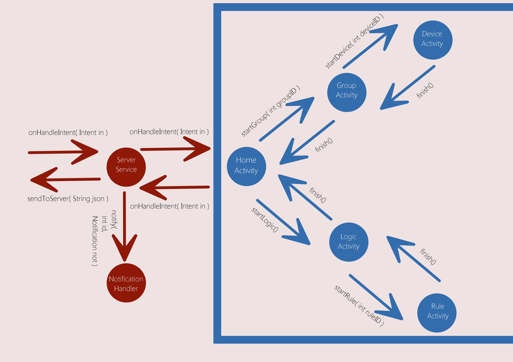
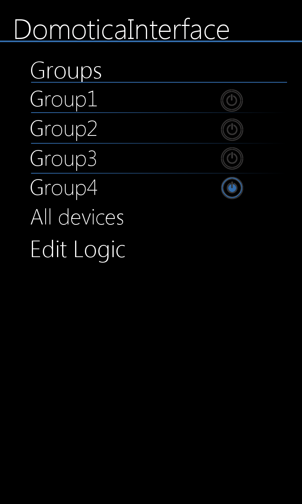
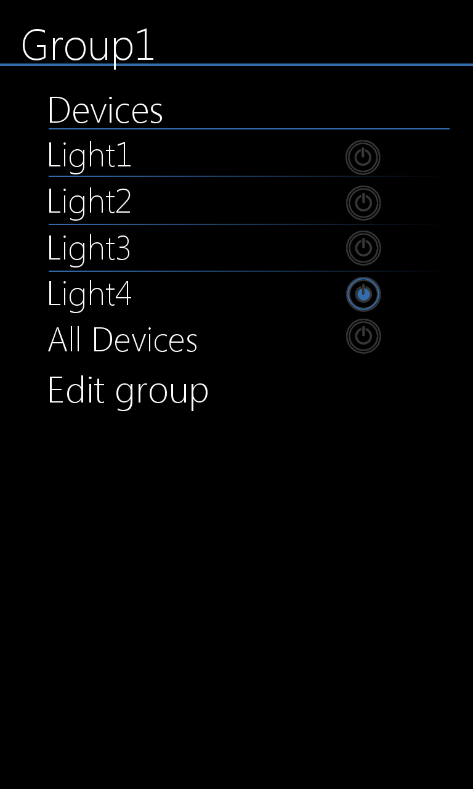
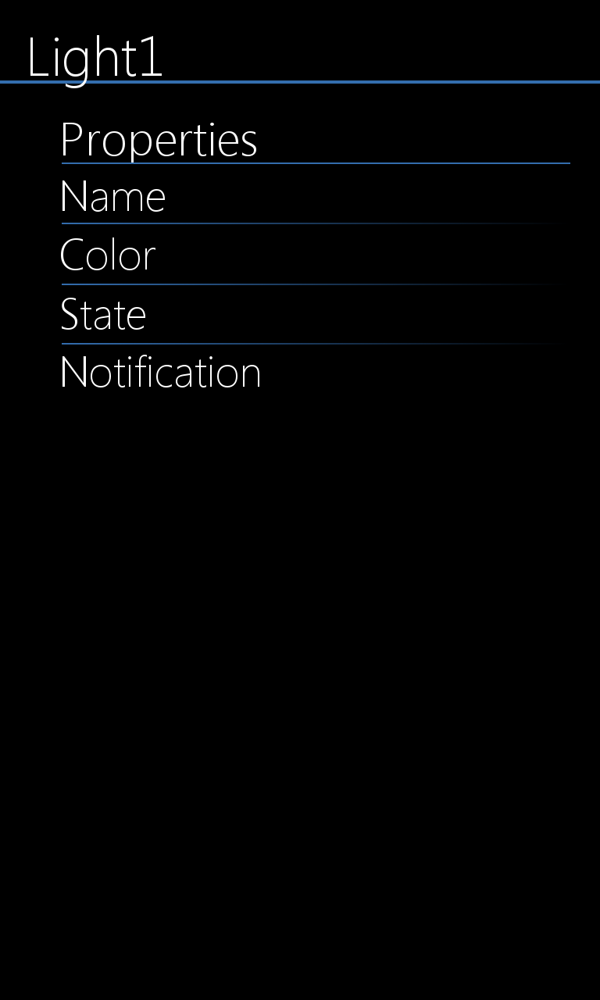
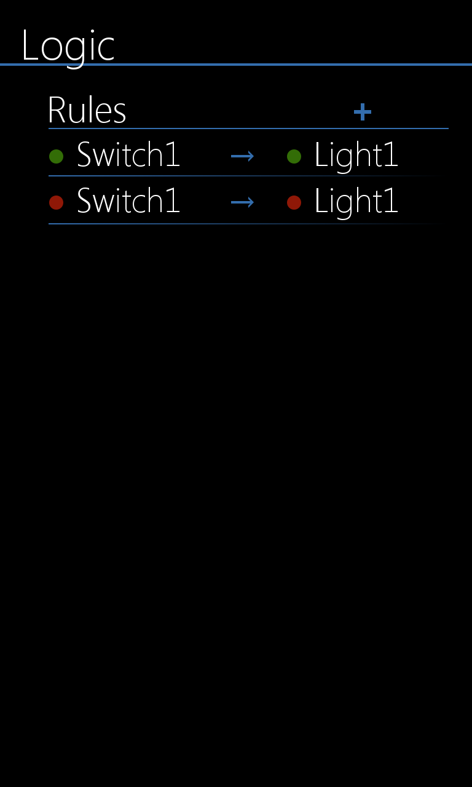
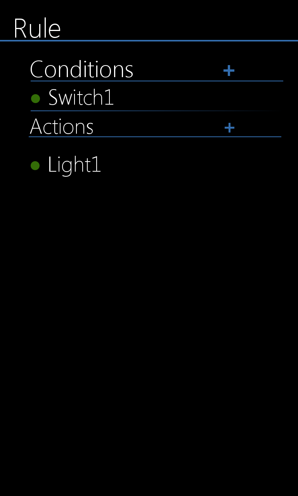

# Design Document
------------------

### Dataflow between the different classes.

## Mockups of the different activities.

### Database design

**Devices**
id (int), name(String), state(int), color(int), notification(boolean)

**groups**
id(int), name(String)

**relation_group_device**
group_id(int), device_id(int)

**logic_rule**
id(int), name(String)

**relation_logic_rule_device**
logic_rule_id(int), device_id(int), state(int), condition(boolean)

**user**
id(int), name(String), email(String)  

### Libraries
